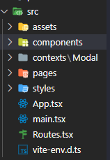

  
  <h1 align="center">Devio Chanllege</h1>

 

# Desafio
Um restaurante precisa poder registrar suas vendas de forma fácil e rápida, este trabalha com preparo de comidas rápidas e o método atual por comanda deixa o processo como um todo mais lento. O restaurante gostaria de ter um ambiente intuitivo listando os produtos mais vendidos e possibilitando a fácil inserção desses no checkout, ele também gostaria de um visual simples, porém moderno.

 

## Planejamento

Ao receber o projeto, não tive muito tempo para me organizar e faze-lo, pois o tempo era curto e ainda tive que trabalhar durante a semana. Então decidi realizar todas a estrutura estática primeiro e para depois realizar a aplicação da lógica.
Contudo as ferramentas utilizadas foram:

* [Vite](https://vitejs.dev/) - Pois é uma ferramenta que agiliza no processo de download do React.
* [Tailwind](https://tailwindcss.com/) - É um Framework no qual agiliza  e facilita manipulação da estilização de um projeto
* [React Router Dom](https://reactrouter.com/en/v6.3.0) - Biblioteca utilizada para fazer a conexão entre as páginas de forma dinâmica
  
 

    
   
    <ul>
        <li>./src - Onde contem todos os arquivos do projeto</li>
        <li>./src/assets - Contem duas pastas chamadas de Images e Icons</li>
        <li>./src/components - Onde é armazenado os componentes</li>
        <li>./src/context - Contem a lógica utilizada para linkar o modal na page Home</li>
        <li>./src/pages - Contem a criação das páginas Home, Kitchen, Delivery e Payment</li>
        <li>./src/styles - Configuração do framework de estilização</li>
        <li>./src/Routes.tsx - Configurações das rotas e dos contexts</li>
    </ul>

 

## Resultado final:
   
    Por não ter trabalhado com nenhum projeto parecido com esse, consegui realizar a seguinte funcionalidade:
* O usuário poderá ver uma pequena quantidade de produtos na tela para seleção rápida.

## Aprendizado:

- Consegui melhorar minha velocidade em criação de página estática.
- Consegui melhorar minha manipulação de dados através do uso do context, pois ele diminui o tanto de states que utilizamos em uma pagina, ou seja, diminuimos umas 8 linhas codigo para apenas 4, deixando o codigo mais limpo e mais fácil de ser entendido.
  
## Dificuldades:

- Parte Estática: tive uma dificuldade fora no esperado, pois não tinha acesso a nenhum dado do prototipo, como: as cores, fontes, imagens e tamanho. No entanto, tive que realizar vários testes para deixar ao mais próximo do proposto.

- Modal: tive grande dificuldade em colocar o modal, por não conseguir estende-lo pela página inteiro, então acabei deixando do jeito que estava, para poder passar para outra funcionalidade.

- Armazenamento de dados: realizei varios testes com varios bancos de dados online (Heroku, Firebase e Swagger Editor), porém estavam dando erros nos quais não conseguinha entender, então acabei deixando de lado para não perder muito tempo.

## Observações:

Entendo que meu código saiu apenas com uma funcionalidade, porém irei continuar melhorando ele e adicionando mais funcionalidades, pois aquele que não corre atrás do prejuizo acaba ficando para trás. Infelizmente, meu prejuizo foi grande, então continuarei em busca de melhorar e ir conseguir completar todas funcionalidades propostas no desafio.

